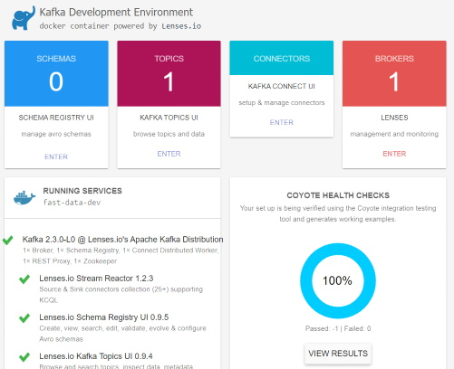

# Kafka

## Usage

Start the stack using

```console
cd kafka
docker-compose up -d kafka
```

Next, check your local Kafka Cluster at [localhost:3030](http://localhost:3030)



## References

### Kafka Connect

- [Kafka connect 101](https://www.slideshare.net/Whiteklay/kafka-connect-101)
- [From Big to Fast Data. How #kafka and #kafka-connect can redefine you ETL and #stream-processing](https://www.slideshare.net/AntwnisChalkiopoulos/from-big-to-fast-data-with-kafka-and-streamprocessing-london-science-museum-imax-presentation)
- Discover and share Connectors and more at [confluent.io/hub](https://www.confluent.io/hub/)

### Kafka & InfluxDB

- [InfluxDB and Kafka: How Companies are Integrating the Two](https://www.influxdata.com/blog/influxdb-and-kafka-how-companies-are-integrating-the-two/)
- [InfluxDB and Kafka: How InfluxData Uses Kafka in Production](https://www.influxdata.com/blog/influxdb-and-kafka-how-influxdata-uses-kafka-in-production/)
- [Time-Series with Kafka, Kafka Connect & InfluxDB](https://lenses.io/blog/2016/12/kafka-influxdb/)
- [Improving InfluxDB with Apache Kafka](https://bitworks.software/en/2019-03-21-improving-influxdb-with-apache-kafka.html)
- [Streaming analysis with Kafka, InfluxDB and Grafana](https://datasciencechalktalk.com/2019/07/17/streaming-analysis-with-kafka-influxdb-and-grafana/)
