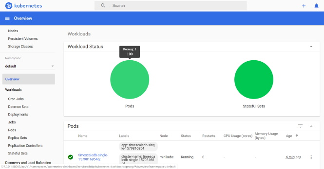

# TimeScaleDB

[TimeScaleDB](https://www.timescale.com/) is an open-source time-series SQL database optimized for fast ingest and complex queries. Packaged as a PostgreSQL extension.

## Setup

### Docker-Compose

Setup a single timescaledb instance

```bash
$cd timescaledb
$docker-compose run --rm timescaledb-cli
Starting hellotick-stack_timescaledb_1 ... done

# Connect
$psql -U postgres -h timescaledb
Password for user postgres: *******
psql (11.5)
Type "help" for help.

# Create database
CREATE database tutorial;
\c tutorial

# Create (hyper) table
CREATE TABLE conditions (
    time        TIMESTAMPTZ         NOT NULL,
    location    text                NOT NULL,
    temperature DOUBLE PRECISION    NULL
);
SELECT create_hypertable('conditions', 'time');

# Insert & query
INSERT INTO conditions(time, location, temperature, humidity)
  VALUES (NOW(), 'office', 70.0, 50.0);
SELECT * FROM conditions ORDER BY time DESC LIMIT 100;
```

### Kubernetes

Get your timescaledb scaled-out in your k8s clusters by installing helm charts from [timescale/timescaledb-kubernetes](https://github.com/timescale/timescaledb-kubernetes).

> **WARNING:** Distributed hypertables are currently in PRIVATE BETA and are not yet meant for production use.



```bash
$helm repo add timescaledb 'https://raw.githubusercontent.com/timescale/timescaledb-kubernetes/master/charts/repo/'
"timescaledb" has been added to your repositories

$helm repo update
Hang tight while we grab the latest from your chart repositories...
...Successfully got an update from the "timescaledb" chart repository
Update Complete. ⎈ Happy Helming!⎈

$helm search repo timescaledb
NAME                                    CHART VERSION   APP VERSION     DESCRIPTION
timescaledb/timescaledb-multinode       0.3.0                           TimescaleDB Multinode Deployment.
timescaledb/timescaledb-single          0.5.1                           TimescaleDB HA Deployment.

# Single node HA recipe
$helm install timescaledb/timescaledb-single --generate-name
NAME: timescaledb-single-1579816854
LAST DEPLOYED: Thu Jan 23 23:00:54 2020
NAMESPACE: default
STATUS: deployed
REVISION: 1
TEST SUITE: None
NOTES:
TimescaleDB can be accessed via port 5432 on the following DNS name from within your cluster:
timescaledb-single-1579816854.default.svc.cluster.local

To get your password for superuser run:

    # superuser password
    PGPASSWORD_POSTGRES=$(kubectl get secret --namespace default timescaledb-single-1579816854-passwords -o jsonpath="{.data.postgres}" | base64 --decode)

    # admin password
    PGPASSWORD_ADMIN=$(kubectl get secret --namespace default timescaledb-single-1579816854-passwords -o jsonpath="{.data.admin}" | base64 --decode)

To connect to your database, chose one of these options:

1. Run a postgres pod and connect using the psql cli:
    # login as superuser
    kubectl run -i --tty --rm psql --image=postgres \
      --env "PGPASSWORD=$PGPASSWORD_POSTGRES" \
      --command -- psql -U postgres \
      -h timescaledb-single-1579816854.default.svc.cluster.local postgres

    # login as admin
    kubectl run -i --tty --rm psql --image=postgres \
      --env "PGPASSWORD=$PGPASSWORD_ADMIN" \
      --command -- psql -U admin \
      -h timescaledb-single-1579816854.default.svc.cluster.local postgres

2. Directly execute a psql session on the master node

   MASTERPOD="$(kubectl get pod -o name --namespace default -l release=timescaledb-single-1579816854,role=master)"
   kubectl exec -i --tty --namespace default ${MASTERPOD} -- psql -U postgres
```

#### MiniKube

**NOTE:** For local development using [minikube](https://kubernetes.io/docs/setup/learning-environment/minikube/)
you will need to start your local k8s cluster before. For example, on Windows

```console
$minikube start
* minikube v1.6.2 on Microsoft Windows 10 Pro 10.0.18362 Build 18362
* Selecting 'hyperv' driver from existing profile (alternates: [])
* Tip: Use 'minikube start -p <name>' to create a new cluster, or 'minikube delete' to delete this one.
* Starting existing hyperv VM for "minikube" ...
* Waiting for the host to be provisioned ...
* Preparing Kubernetes v1.17.0 on Docker '19.03.5' ...
* Launching Kubernetes ...
* Done! kubectl is now configured to use "minikube"

$minikube dashboard
* Verifying dashboard health ...
* Launching proxy ...
* Verifying proxy health ...
* Opening http://127.0.0.1:58063/api/v1/namespaces/kubernetes-dashboard/services/http:kubernetes-dashboard:/proxy/ in your default browser...
```

## Administration

You may use the PostgreSQL Web UI [sosedoff/pgweb](https://github.com/sosedoff/pgweb), i.e.

```console
docker-compose up -d pgweb
```

And check [localhost:5433](http://localhost:5433)


## Data Import / Migration

### CSV Import

Download CSV sample data from

- [Sample Datasets](https://docs.timescale.com/latest/tutorials/other-sample-datasets)

and upload posting to `/conditions/upload`, e.g.

```console
$curl -X POST http://localhost:5000/conditions/upload --data-binary @weather_small_conditions.csv
1000000
```

See also

- [Inserting data into the hypertable](https://docs.timescale.com/latest/getting-started/migrating-data#csv-import)
- [timescale/timescaledb-parallel-copy](https://github.com/timescale/timescaledb-parallel-copy)

### From InfluxDB

- [Migration from InfluxDB to TimescaleDB using Outflux](https://docs.timescale.com/latest/getting-started/migrating-data#outflux)

## References

- [blog.timescale.com](https://blog.timescale.com/blog/)
- [timescale/timescaledb](https://github.com/timescale/timescaledb)
- [timescale/tsbs](https://github.com/timescale/tsbs) - Time Series Benchmark Suite, a tool for comparing and evaluating databases for time series data
- [TimescaleDB vs. InfluxDB: Purpose built differently for time-series data](https://blog.timescale.com/blog/timescaledb-vs-influxdb-for-time-series-data-timescale-influx-sql-nosql-36489299877/)
- [Building a scalable time-series database using Postgres](https://www.percona.com/live/17/sites/default/files/slides/timescale-percona-Apr-2017.pdf)
- [Benchmarking TimescaleDB vs. InfluxDB for Time-Series Data](https://www.outfluxdata.com/assets/Timescale_WhitePaper_Benchmarking_Influx.pdf)
- [Time-series data: Why (and how) to use a relational database instead of NoSQL](https://blog.timescale.com/blog/time-series-data-why-and-how-to-use-a-relational-database-instead-of-nosql-d0cd6975e87c/)

### Scale-Out

> **WARNING:** Distributed hypertables are currently in PRIVATE BETA and are not yet meant for production use.

- [Scaling out using Distributed Hypertables](https://docs.timescale.com/clustering/getting-started/scaling-out)
- [timescale/timescaledb-kubernetes](https://github.com/timescale/timescaledb-kubernetes)

### .NET

- [Entity Framework Core / Npgsql](https://www.npgsql.org/efcore/)
- [ASP.NET Core, Entity Framework Core with PostgreSQL Code First](https://medium.com/faun/asp-net-core-entity-framework-core-with-postgresql-code-first-d99b909796d7)
- [Timeseries Databases Part 3: Writing Data to TimescaleDB from .NET](https://bytefish.de/blog/timeseries_databases_3_timescaledb/)
- [bytefish/GermanWeatherDataExample](https://github.com/bytefish/GermanWeatherDataExample)
