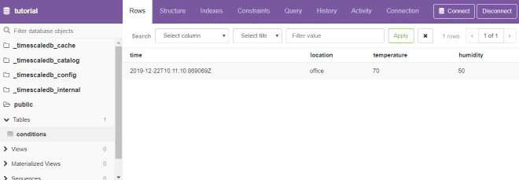
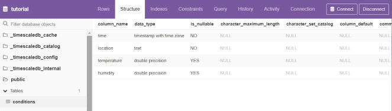

# TimeScaleDB

- [timescale/timescaledb](https://github.com/timescale/timescaledb)
- [TimescaleDB vs. InfluxDB: Purpose built differently for time-series data](https://blog.timescale.com/blog/timescaledb-vs-influxdb-for-time-series-data-timescale-influx-sql-nosql-36489299877/)
- [Building a scalable time-series database using Postgres](https://www.percona.com/live/17/sites/default/files/slides/timescale-percona-Apr-2017.pdf)
- [Benchmarking TimescaleDB vs. InfluxDB for Time-Series Data](https://www.outfluxdata.com/assets/Timescale_WhitePaper_Benchmarking_Influx.pdf)

## Setup

Setup a timescaledb instance

```bash
$docker-compose -f docker-compose.timescaledb.yml run --rm timescaledb-cli
Starting hellotick-stack_timescaledb_1 ... done

# Connect
$psql -U postgres -h timescaledb
Password for user postgres: *******
psql (11.5)
Type "help" for help.

# Create database
CREATE database tutorial;
\c tutorial

# Create (hyper) table
CREATE TABLE conditions (
    time        TIMESTAMPTZ         NOT NULL,
    location    text                NOT NULL,
    temperature DOUBLE PRECISION    NULL
);
SELECT create_hypertable('conditions', 'time');

# Insert & query
INSERT INTO conditions(time, location, temperature, humidity)
  VALUES (NOW(), 'office', 70.0, 50.0);
SELECT * FROM conditions ORDER BY time DESC LIMIT 100;
```

## Administration

You may use the PostgreSQL Web UI [sosedoff/pgweb](https://github.com/sosedoff/pgweb), i.e.

```console
docker-compose up -d pgweb
```

And check [localhost:5433](http://localhost:5433)





## Data Import / Migration

### CSV Import

- [Inserting data into the hypertable](https://docs.timescale.com/latest/getting-started/migrating-data#csv-import)
- [timescale/timescaledb-parallel-copy](https://github.com/timescale/timescaledb-parallel-copy)

### From InfluxDB

- [Migration from InfluxDB to TimescaleDB using Outflux](https://docs.timescale.com/latest/getting-started/migrating-data#outflux)